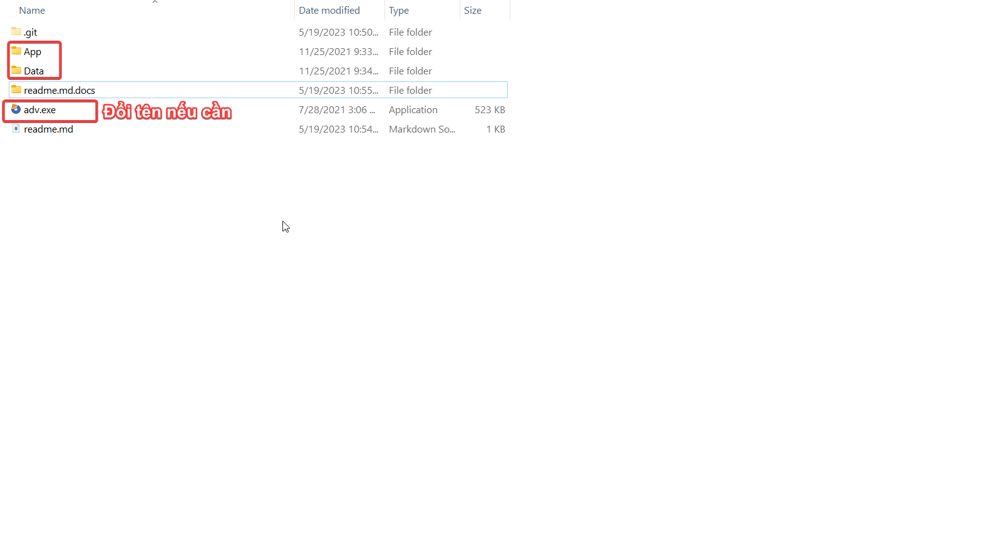
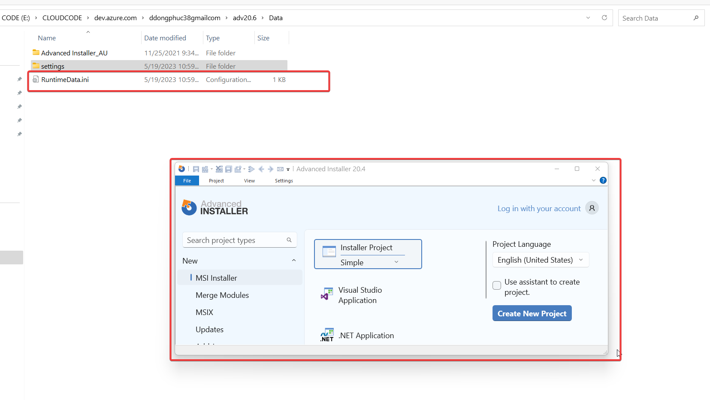
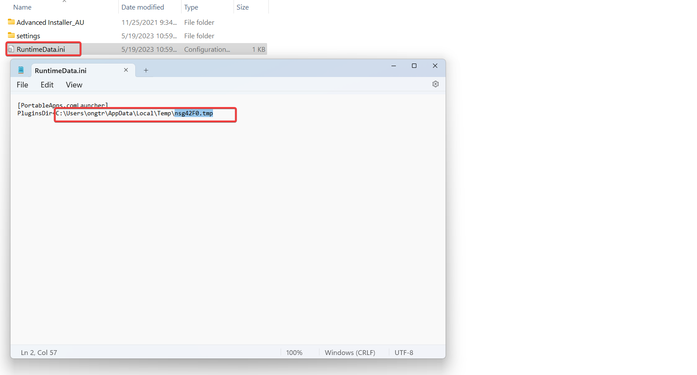
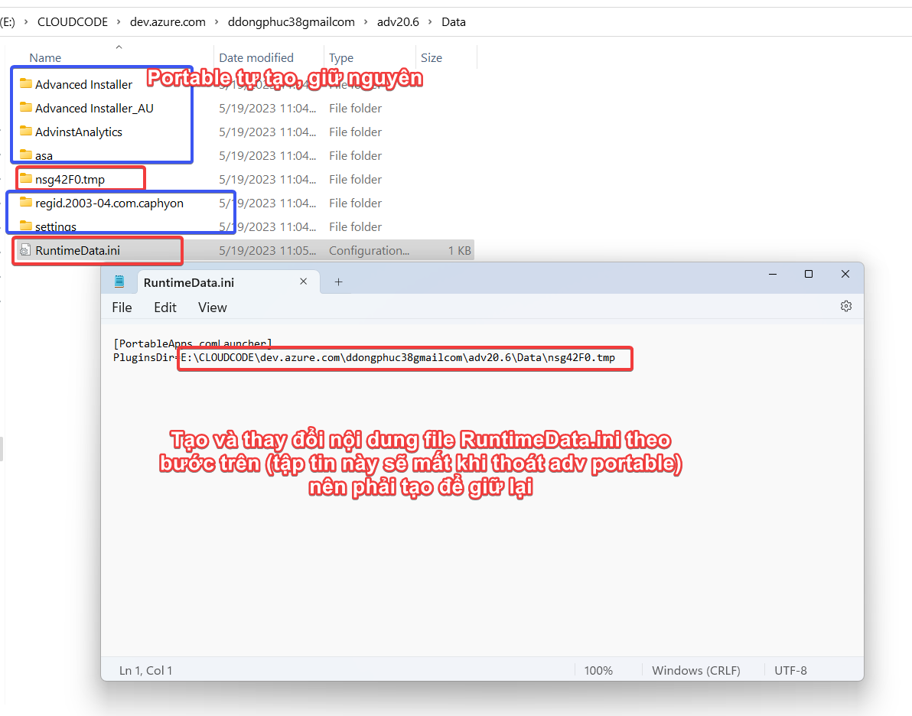
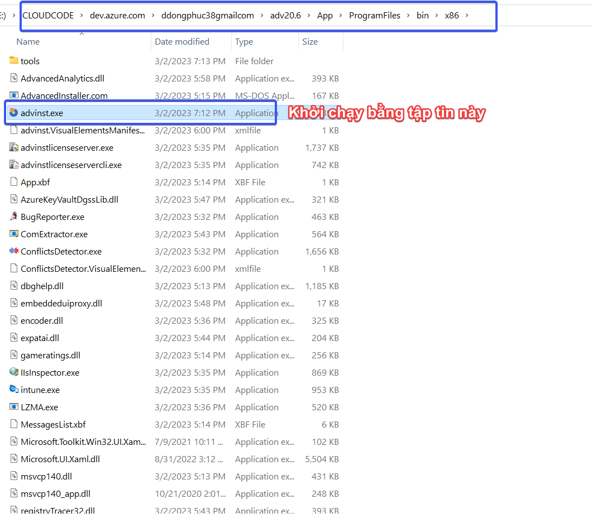
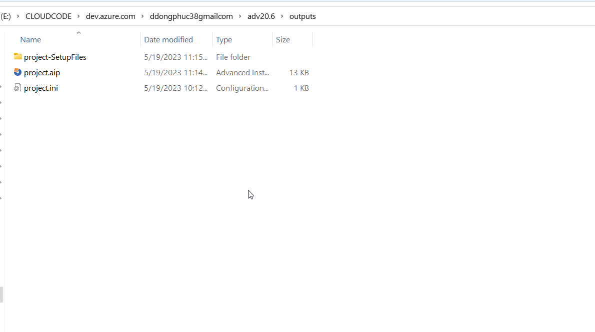
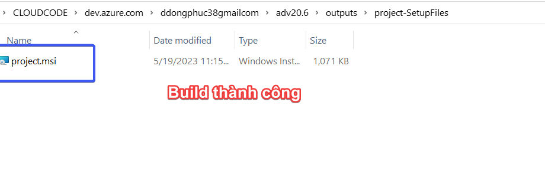

# SETUP ADV20.4

## Bước 1 - Giải nén Portable

## Bước 2 - Khởi chạy để tạo các tập tin cần thiết

Lấy thông tin file `RuntimeData.ini`

Chép file và giữ lại `RuntimeData.ini` sau khi thoát adv.exe

## Bước 3 - Chạy thử Local

Tạo project để thực thi

## Bước 4 - Đưa toàn bộ thư mục lên git

